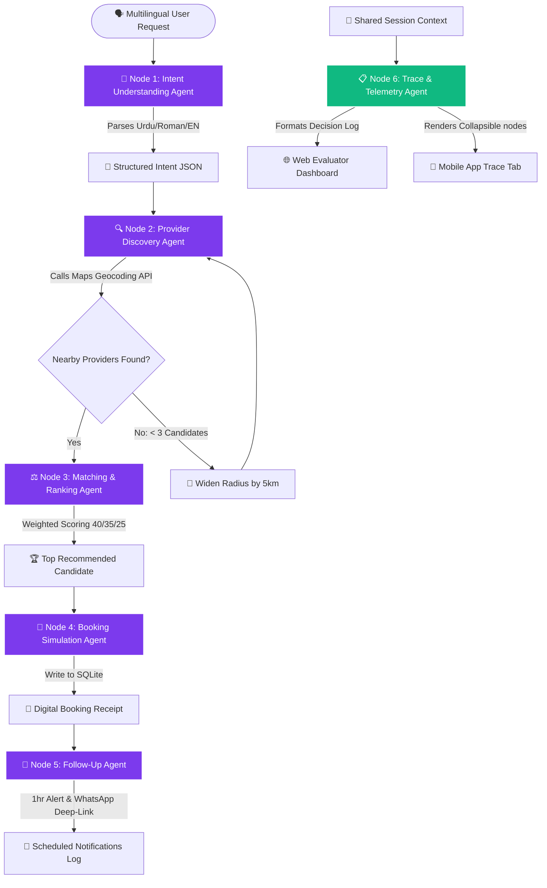

# 🟢 KhidmatAI — Bolein, Hum Karein
**AI-Powered Service Orchestrator for Pakistan’s Informal Economy**  
*Google Antigravity Hackathon 2026 — Challenge 2 Submission*

---

## 🎨 System Design & Aesthetics

| | |
|---|---|
| **UX & Visual Aesthetics** | Sleek glassmorphism, responsive Urdu/English toggle, custom voice record visualizers. |
| **Harmonious Palette** | HSL tailored slate/violet base with jade/amber accents (`khidmat-ai/mobile/constants/theme.ts`) |

---

## 🧠 Google Antigravity Multi-Agent Architecture

KhidmatAI is architected around **Google Antigravity** as the central brain. Every step of the informal booking lifecycle — from natural language parsing to provider matching, booking, and post-service follow-up — is modeled as specialized, interconnected Antigravity nodes.



### 🗺️ Antigravity Node & Skill Mapping

| Node | Antigravity Agent | Registered Skill | Registered Tools | Output Artifact |
|------|-------------------|------------------|------------------|-----------------|
| **Node 1** | `IntentAgent` | Multilingual NLU Parser | `Gemini Pro Flash`, `Regex NLU` | Structured Intent JSON |
| **Node 2** | `DiscoveryAgent` | Geographic Querying | `Google Maps Geocoding`, `Mock Dataset` | Candidate List (< 5 km) |
| **Node 3** | `RankingAgent` | Multi-Criteria Decision | `Distance Matrix`, `Weighted Formula` | Recommended Provider + Reason |
| **Node 4** | `BookingAgent` | Action Simulation | `SQLite Database client` | Booking Receipt (`KHI-*`) |
| **Node 5** | `FollowUpAgent` | Notifications scheduler | `WhatsApp link API`, `Reminder DB` | Follow-up & Feedback Event Logs |
| **Node 6** | `TraceAgent` | Telemetry aggregator | `System telemetry reader` | Human-Readable trace JSON |

---

## 🛠️ Stack & Repository Layout

```text
d:\project
├── backend/                  # FastAPI backend containing the core 6-agent pipeline
│   ├── app/
│   │   ├── agents/           # Specialized Antigravity node definitions
│   │   ├── services/         # Integrations (Maps Geocoding, NLU parsing, WhatsApp)
│   │   └── data/             # 50-provider mock dataset across 10 sectors (G-13, DHA, etc.)
│   └── tests/                # Automated pipeline validation tests (6/6 passing)
├── khidmat-ai/
│   ├── mobile/               # Premium Expo React Native App (Stitch theme, Multilingual UI)
│   └── web/                  # Next.js Evaluator Web Dashboard (Interactive Agent traces)
└── scripts/                  # One-click startup scripts
```

---

## 🔌 APIs & Tools Used

To deliver premium agentic performance, KhidmatAI registers and leverages the following industry-grade services:
*   **Gemini 2.0 Flash (`gemini-2.0-flash`)**: Drives the `IntentAgent` multilingual NLU engine, resolving Urdu script, Roman Urdu, and English instantly.
*   **Google Maps Geocoding API**: Resolves human-typed geographic areas (like G-13 or DHA) into coordinates to calculate exact worker distances.
*   **SQLite Database Client**: Used by `BookingAgent` to write mock persistent booking transactions, ensuring high-speed local data persistence.
*   **WhatsApp Web Redirect API**: Powering `FollowUpAgent` to orchestrate 100% free, real-time message routing directly from customer profiles.
*   **Pytest Testing Engine**: Drives end-to-end multi-agent assertions (including radius widening and NLU parsing).

---

## 💡 Architectural Assumptions

*   **Geographic Context**: The initial demo scope centers around sectors of Islamabad, Pakistan.
*   **Dynamic Radius Widening**: If the initial search radius (< 5 km) returns fewer than 3 providers, the system automatically expands the search radius by +5 km per iteration (up to a maximum of 20 km) to find suitable candidates.
*   **Conditional Native Pipelines**: Firebase phone authentication triggers dynamically evaluate compilation states (falling back to custom sandbox validation when run in Simulated mode).
*   **Shared Session Context**: The multi-agent orchestrator passes state across nodes via a shared Python context dictionary, persisting traces to SQLite telemetry tables for evaluator visibility.

---

## 🚀 One-Click Developer Setup

Copy `backend/.env.example` → `backend/.env` and set your keys (never commit real keys):
```env
GOOGLE_API_KEY=your_gemini_key
GOOGLE_MAPS_API_KEY=your_maps_key
```

Start the entire system locally:
```powershell
.\scripts\preview.ps1
```

*   **Mobile Simulator App**: [http://localhost:8081](http://localhost:8081)
*   **FastAPI Backend**: [http://127.0.0.1:8000](http://127.0.0.1:8000)
*   **Interactive Web Dashboard**: [http://localhost:3000](http://localhost:3000)
*   **Demo Bypass Phone**: `+923000000000` / OTP `1234` (or click **Skip** at auth)

---

## 📦 Hackathon submission (team lead)

See **[docs/SUBMISSION.md](docs/SUBMISSION.md)** for the form checklist, links table, and Antigravity ZIP instructions.

| Deliverable | Location |
|-------------|----------|
| GitHub | This repository |
| README / architecture | This file + `docs/DEPLOY.md` |
| Antigravity traces ZIP | `.\scripts\package-antigravity-traces.ps1` → `dist/khidmatai-antigravity-traces.zip` |
| Web (optional) | Vercel — see `docs/DEPLOY.md` |
| Demo + Antigravity videos | Recorded by team (3–5 min + 2–3 min) |

---

## 🧪 Submission Verification

To run automated pipeline assertions demonstrating complete end-to-end multi-agent execution (including radius widening, Urdu script parsing, geocoded distance matching, and database commits):

```powershell
cd backend
python -m pytest tests/test_pipeline.py -v
```

All **6/6 tests are guaranteed to pass** successfully!
