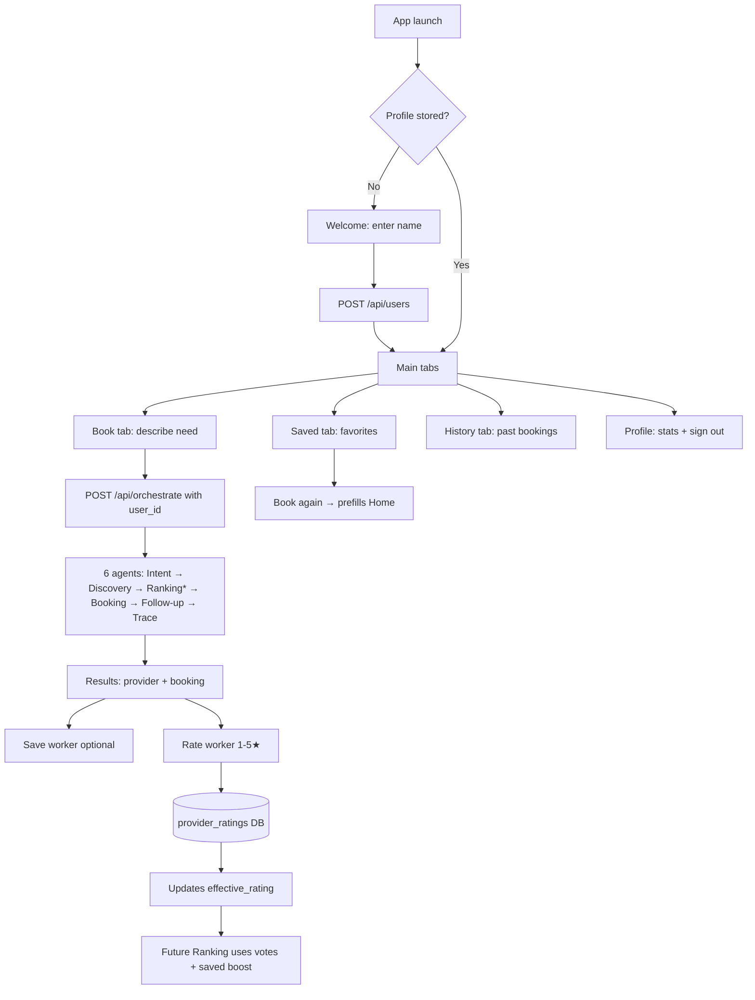

# KhidmatAI — Market Research & Full User Flow

## How similar apps operate

### Pakistan / South Asia

| App | Model | User flow highlights |
|-----|--------|----------------------|
| **[Mahir Company](https://mahircompany.com/)** | On-demand home services (Lahore, Karachi, Islamabad, RWP) | Category pick → book in ~3 taps → pro arrives (~60 min) → pay → rate. 200+ services, vetted pros (Tasdeeq). |
| **Urban Company (UC)** | Managed marketplace + trained partners | Browse/service detail → slot → pay upfront → track → post-job rating drives partner quality. |
| **Bykea / inDrive-style** | Real-time matching | Location + need → nearest available → live tracking. Less “favorite pro” retention. |

**Common pattern:** Discover → Book → Fulfill → **Rate** → **Rebook** (favorites or history).

### Global (TaskRabbit, Thumbtack, Handy)

1. **Sign up** (phone/email/social)
2. **Describe job** (text, photos, or category)
3. **Match** (algorithm: distance, rating, availability, sometimes repeat customer boost)
4. **Book + pay** (escrow or upfront)
5. **Track** arrival / completion
6. **Rate & review** (feeds ranking; one review per job)
7. **Save favorite** → faster rebook ([TaskRabbit documents “Save favorites”](https://play.google.com/store/apps/details?id=com.taskrabbit.droid.consumer))

### What KhidmatAI adds (differentiator)

- **Natural language** (Urdu / Roman / English) instead of category grids only
- **Agent trace** (transparent 6-step reasoning for hackathon/judges)
- **Personalized ranking** from **your** ratings + saved workers (not only global stars)

---

## Full user flow (implemented)

\*Ranking formula with user logged in:

- **40%** distance  
- **30%** effective rating (static JSON blended with community votes)  
- **25%** availability  
- **5%** personalization (saved worker, past booking, your star history)

---

## Screen map (mobile)

| Screen | Purpose |
|--------|---------|
| Welcome / Clerk | Phone OTP (Clerk) or demo name |
| Book → Home | NL request + **live GPS** bar |
| Book → Payment | Card / JazzCash / Easypaisa → SMS + WhatsApp |
| Book → Results | Match, booking, save, notifications log |
| Book → Rate | 1–5 stars + optional save |
| Book → Trace / Receipt | Agent log & confirmation |
| Saved | List favorites, rebook, remove |
| History | Past bookings + rated status |
| Profile | Stats, sign out (Clerk + local) |

---

## API endpoints (user features)

| Method | Path | Purpose |
|--------|------|---------|
| POST | `/api/users` | Create user |
| GET | `/api/users/{id}` | Profile + stats |
| GET | `/api/users/{id}/saved` | Saved workers |
| POST | `/api/users/{id}/saved/{provider_id}` | Save |
| DELETE | `/api/users/{id}/saved/{provider_id}` | Unsave |
| GET | `/api/users/{id}/bookings` | History |
| POST | `/api/users/ratings` | Submit vote (one per booking) |
| POST | `/api/orchestrate` | Full pipeline (`user_id`, `user_lat`, `user_lng`, `customer_phone`) |
| POST | `/api/auth/sync` | Link Clerk user → `USR-*` |
| POST | `/api/payments/confirm` | Pay → CONFIRMED + SMS/WhatsApp |

---

## Business rules

- **One rating per booking** per user (DB unique constraint)
- **Cannot rate** another user’s booking
- **Effective rating** = blend of seed data + real votes (more votes → more weight on community score)
- **Saved workers** get ranking boost; low personal ratings down-rank that provider for you
- **No real SMS/payments** in MVP (simulated follow-up only)
